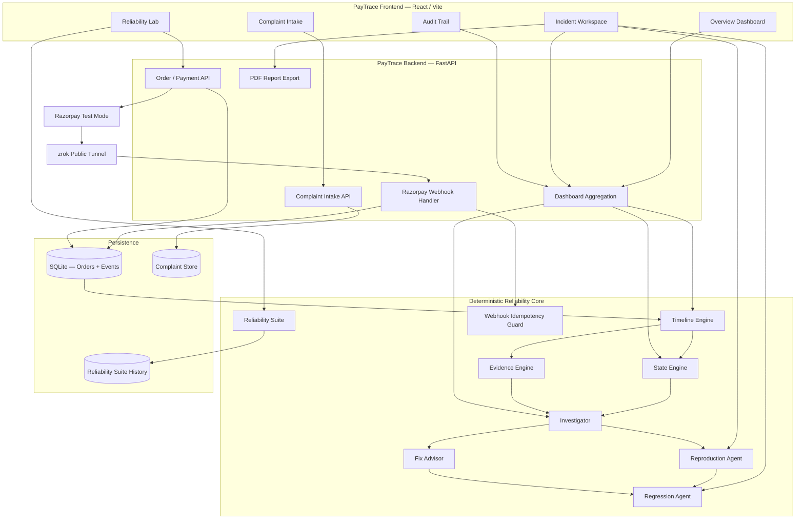

# PayTrace AI

> **Agentic Payment Reliability Engineer for Razorpay payment systems**

PayTrace AI investigates payment-state failures that occur **between the payment provider and the merchant system**. It correlates complaints with deterministic payment evidence, detects state divergence, reconstructs the failure timeline, identifies the likely failure boundary, reproduces incidents safely, recommends a fix, verifies the fix through regression testing, and exports an auditable incident report.

**Buildathon track:** Open Track  
**Environment:** Razorpay Test Mode  
**Core principle:** Financial truth is deterministic. AI may explain verified evidence, but it does not decide payment truth.

---

## Why PayTrace exists

A payment can succeed at the provider while the merchant still fails afterward:

```text
Provider payment = CAPTURED
Provider order   = PAID
Merchant state   = PAYMENT_VERIFIED

Provider Truth ≠ Merchant Truth
```

Customers experience this as:

- “Money was deducted but the merchant still shows pending.”
- “Payment succeeded, but the order was not updated.”
- “The transaction later recovered, but nobody knows why.”

PayTrace answers:

1. What happened?
2. Is provider truth different from merchant truth?
3. Where did the failure occur?
4. Can the same failure be reproduced safely?
5. What fix should be applied?
6. Does regression testing prove the fix?

---

## Product flow

```mermaid
flowchart LR
    A["Complaint / Test Payment"] --> B["Evidence Collection"]
    B --> C["State Divergence Detection"]
    C --> D["Root-Cause Investigation"]
    D --> E["Failure Reproduction"]
    E --> F["Fix Advisor"]
    F --> G["Regression Verification"]
    G --> H["Reliability Score"]
    H --> I["Auditable Incident PDF"]
```



---

## Buildathon demo

```text
Run PayTrace Demo
        ↓
Enable controlled webhook fault
        ↓
Complete ₹499 Razorpay Test Mode payment
        ↓
Detect provider/merchant divergence
        ↓
Confirm WEBHOOK_HANDLER_FAILURE
        ↓
Reproduce failure signature
        ↓
Confirm hypothesis
        ↓
Run regression verification
        ↓
FIX_VERIFIED
        ↓
Return environment to HEALTHY MODE
```

The checkout confirmation remains human-controlled.

---

## Key capabilities

### Razorpay Test Mode integration
PayTrace creates test orders, verifies checkout signatures, fetches authoritative provider state, and processes Razorpay webhooks such as:

```text
payment.captured
order.paid
```

### Deterministic payment-state engine
Example:

```text
Provider payment    CAPTURED
Provider order      PAID
Merchant state      PAYMENT_VERIFIED

Result:
STATE_DIVERGENCE
Severity: HIGH
```

### Evidence timeline
PayTrace records provider events, checkout callbacks, signature verification, webhook arrival, merchant processing, merchant state transitions, reproduction runs, and regression runs.

### Controlled fault injection
The Reliability Lab can deliberately fail merchant-side webhook processing after evidence is recorded, without production traffic or real money.

### Root-cause investigation
Supported hypotheses include:

```text
WEBHOOK_HANDLER_FAILURE
WEBHOOK_NOT_RECEIVED
MERCHANT_STATE_WRITE_FAILURE
PENDING_ASYNC_PROCESSING
```

A validated incident can produce:

```text
Root cause: WEBHOOK_HANDLER_FAILURE
Failure boundary: MERCHANT_WEBHOOK_PROCESSING
Confidence: 98%
```

### Recovery-aware analysis
PayTrace preserves historical evidence even after retry recovery:

```text
Original:
CAPTURED ≠ PAYMENT_VERIFIED

Later:
CAPTURED = PAID

Incident phase:
RECOVERED
```

### Failure reproduction
PayTrace replays the incident signature inside an isolated reliability lab:

```json
{
  "provider_paid": true,
  "webhook_processing_failed": true,
  "merchant_paid": false
}
```

Matching replay:

```text
REPRODUCED
HYPOTHESIS_STATUS = CONFIRMED
```

### Fix Advisor
For confirmed webhook-handler failures, PayTrace recommends:

1. Verify Razorpay webhook signatures.
2. Make webhook processing idempotent.
3. Persist merchant `PAID` before returning HTTP 2xx.
4. Return non-2xx on genuine processing failure so retry remains possible.
5. Reconcile provider-paid / merchant-unpaid orders.

### Regression verification

| Signal | Before fix | After fix |
|---|---:|---:|
| Provider paid | Yes | Yes |
| Webhook processing failed | Yes | No |
| Merchant paid | No | Yes |
| State divergence | Yes | No |

Successful result:

```text
PASS
FIX_VERIFIED
```

### Executable Reliability Suite

| Scenario | Expected result |
|---|---|
| Normal payment convergence | PASS |
| Webhook failure + retry recovery | PASS |
| Duplicate webhook idempotency | PASS |
| Out-of-order event tolerance | PASS |
| Delayed webhook recovery | PASS |

```text
Reliability Score = passed scenarios / total executable scenarios × 100
```

Current suite:

```text
5 / 5 scenarios passed
Reliability Score = 100 / 100
```

> This is a controlled-lab scenario score, not a claim of 100% production reliability.

---

## Complaint Intelligence

PayTrace treats a complaint as a **claim**, not financial truth.

Example:

> Customer says ₹499 was deducted but the merchant dashboard still shows the payment as pending.

Possible result:

```text
Reported issue:
PROVIDER_MERCHANT_STATE_MISMATCH_REPORTED

Correlation:
CORRELATED_RECOVERED

Basis:
EXACT_ORDER_ID

Confidence:
100%

Provider paid:
YES

Merchant state:
PAID

State divergence:
NOT ACTIVE

Historical root cause:
WEBHOOK_HANDLER_FAILURE
```

---

## Professional incident reports

Incident Workspace includes **Export Incident PDF** with:

- order and payment identifiers
- reported symptom
- complaint correlation
- provider truth
- merchant truth
- divergence state
- root cause and confidence
- failure boundary
- supporting evidence
- event timeline
- reproduction proof
- fix recommendation
- regression verification
- reliability-suite context
- safety and audit statement

---

## System architecture



More detail: [`docs/ARCHITECTURE.md`](docs/ARCHITECTURE.md)

---

## Technology stack

| Layer | Technology |
|---|---|
| Frontend | React + Vite |
| Backend | FastAPI |
| Language | Python |
| Payment provider | Razorpay Test Mode |
| Transaction persistence | SQLite |
| Complaint prototype store | JSON |
| Reliability history | JSON |
| PDF generation | ReportLab |
| Webhook tunnel | zrok |
| Styling | Custom CSS |
| Generative AI | Optional / graceful degradation |

---

## AI design philosophy

Deterministic systems decide:

```text
Was the signature valid?
Was the payment captured?
Was the provider order paid?
Was the webhook received?
Did webhook processing fail?
Is merchant state PAID?
Is there state divergence?
```

AI may assist with:

```text
evidence summarization
human-readable explanations
incident narratives
```

If an external AI provider is unavailable, PayTrace continues using deterministic investigation.

---

## Safety boundaries

PayTrace does **not**:

- move real money
- modify production code
- contact customers automatically
- issue refunds automatically
- create charges automatically
- trust complaints as payment truth
- ask an LLM to decide whether a payment succeeded

The prototype runs in **Razorpay Test Mode**.

---

## Project structure

```text
PAYTRACE AI/
├── backend/
│   ├── app/
│   │   ├── main.py
│   │   ├── db.py
│   │   ├── agents/
│   │   │   ├── investigator.py
│   │   │   ├── ai_investigator.py
│   │   │   ├── reproduction_agent.py
│   │   │   ├── fix_advisor.py
│   │   │   ├── regression_agent.py
│   │   │   └── complaint_intake.py
│   │   ├── engines/
│   │   │   ├── timeline_engine.py
│   │   │   ├── state_engine.py
│   │   │   ├── evidence_engine.py
│   │   │   ├── reproduction_engine.py
│   │   │   ├── regression_engine.py
│   │   │   ├── complaint_engine.py
│   │   │   └── reliability_suite.py
│   │   └── services/
│   │       ├── order_service.py
│   │       ├── event_service.py
│   │       ├── dashboard_service.py
│   │       ├── complaint_service.py
│   │       ├── reliability_service.py
│   │       ├── webhook_guard.py
│   │       └── report_export_service.py
│   └── data/
│       ├── complaints.json
│       └── reliability_suite.json
├── frontend/
│   ├── index.html
│   └── src/
│       ├── App.jsx
│       ├── App.css
│       └── index.css
├── docs/
│   ├── ARCHITECTURE.md
│   ├── DEMO_GUIDE.md
│   └── API_REFERENCE.md
└── README.md
```

---

## Local setup

Detailed demo/setup steps: [`docs/DEMO_GUIDE.md`](docs/DEMO_GUIDE.md)

High level:

```text
1. Configure Razorpay Test Mode credentials.
2. Start FastAPI backend.
3. Start React/Vite frontend.
4. Start zrok public tunnel.
5. Configure Razorpay webhook URL.
6. Open Reliability Lab.
7. Run the guided demo.
```

---

## Razorpay webhook configuration

```text
https://<CURRENT-ZROK-DOMAIN>/api/webhooks/razorpay
```

Recommended Test Mode events:

```text
payment.captured
order.paid
```

Configured Razorpay webhook secret must match:

```env
RAZORPAY_WEBHOOK_SECRET=
```

---

## Demo success condition

```text
Inject webhook fault             PASS
Complete test payment            PASS
Detect divergence                PASS
Diagnose root cause              PASS
Reproduce failure                PASS
Verify fix                       PASS

ROOT CAUSE:
WEBHOOK_HANDLER_FAILURE

CONFIDENCE:
98%

FINAL VERDICT:
FIX_VERIFIED

RELIABILITY SUITE:
5 / 5 PASS
```

---

## Selected API routes

| Method | Endpoint | Purpose |
|---|---|---|
| `GET` | `/health` | Backend health |
| `GET` | `/api/faults` | Fault state |
| `POST` | `/api/faults/webhook/enable` | Enable controlled webhook failure |
| `POST` | `/api/faults/webhook/disable` | Disable fault |
| `POST` | `/api/orders` | Create Razorpay test order |
| `POST` | `/api/payments/verify` | Verify checkout + provider state |
| `POST` | `/api/webhooks/razorpay` | Razorpay webhook receiver |
| `GET` | `/api/orders/{id}/timeline` | Event timeline |
| `GET` | `/api/orders/{id}/analysis` | State divergence |
| `GET` | `/api/orders/{id}/investigation` | Root-cause analysis |
| `POST` | `/api/orders/{id}/reproduce` | Reproduce incident |
| `GET` | `/api/orders/{id}/fix` | Fix recommendation |
| `POST` | `/api/orders/{id}/verify-fix` | Regression verification |
| `GET` | `/api/orders/{id}/report` | Aggregated incident report |
| `GET` | `/api/orders/{id}/export/pdf` | Download incident PDF |
| `POST` | `/api/complaints` | Complaint intake |
| `POST` | `/api/reliability/suite/run` | Run reliability suite |

Full API notes: [`docs/API_REFERENCE.md`](docs/API_REFERENCE.md)

---

## Prototype limitations

- webhook idempotency guard is currently process-local
- complaint persistence is JSON-based
- reliability scenarios are controlled lab scenarios
- public webhook testing depends on a temporary zrok tunnel
- only a limited set of reliability failure classes is currently modeled

These are disclosed intentionally.

---

## Future direction

- persistent webhook event registry with a database uniqueness constraint
- reconciliation scheduler
- provider adapters beyond Razorpay
- queue-backed webhook processing
- dead-letter/retry handling
- richer historical reliability metrics
- incident clustering
- private/local model explanations

---

## PayTrace AI

**Complaint → Evidence → State Divergence → Root Cause → Reproduction → Fix → Verified Recovery**
