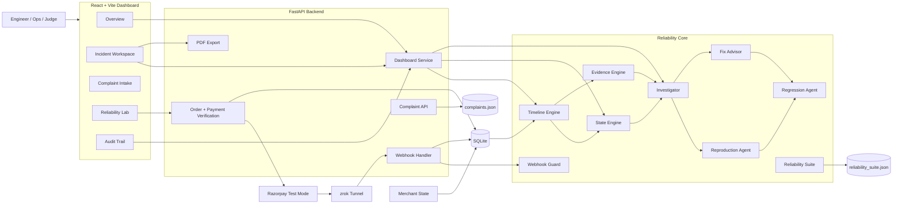
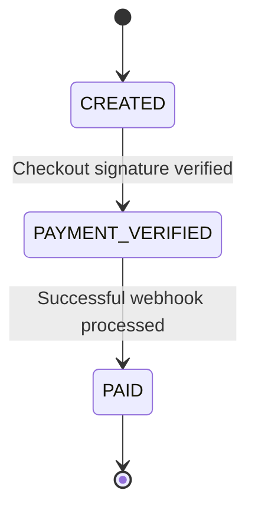
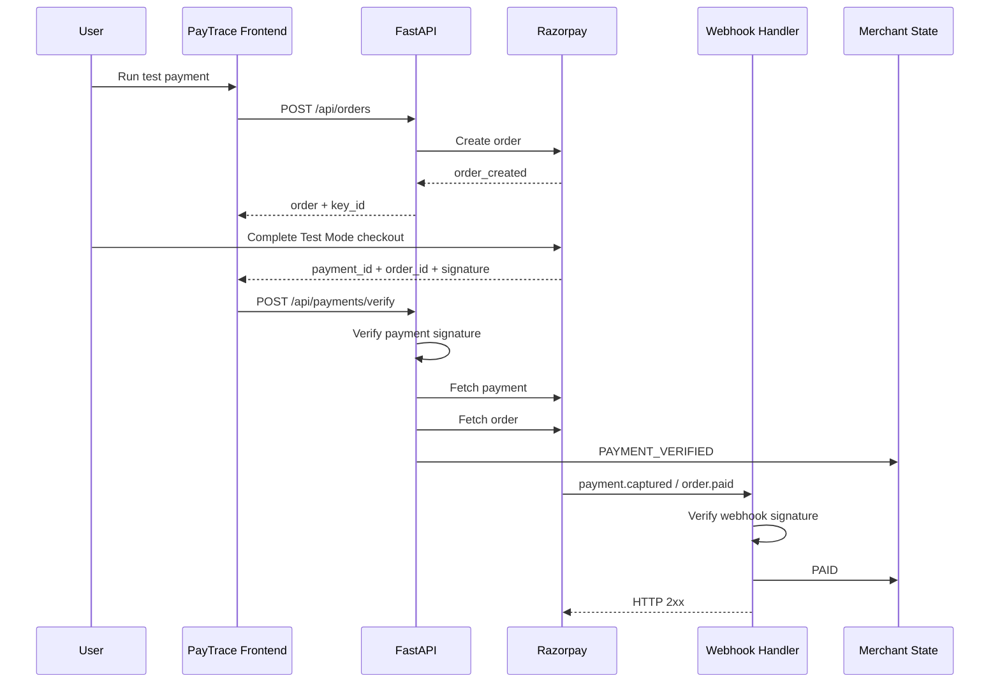
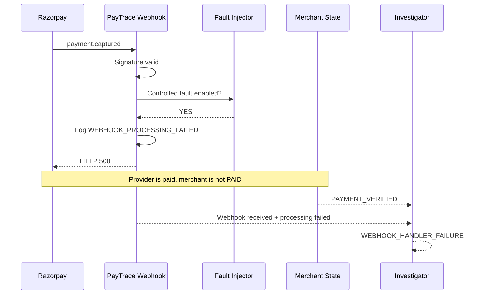
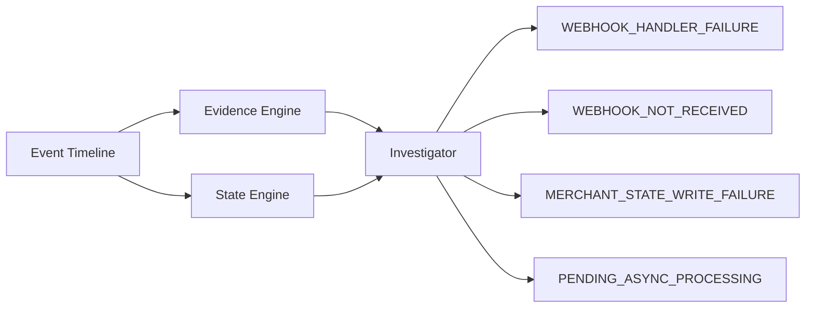
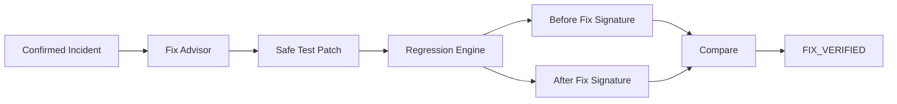

# PayTrace AI — Architecture

## Architectural principle

PayTrace is built around one rule:

> **Financial truth must come from deterministic payment evidence.**

The system separates:

```text
Truth plane        → signatures, provider states, merchant states, events
Reasoning plane    → evidence correlation and root-cause hypotheses
Experiment plane   → safe reproduction and regression testing
Presentation plane → dashboard, audit trail, incident PDF
```

---

## High-level architecture



---

## Payment-state model

Healthy merchant lifecycle:



The frontend checkout callback is **not** treated as the final merchant payment truth.

---

## Healthy payment sequence



---

## Controlled webhook failure



Result:

```text
Provider:
payment_captured = true
order_paid       = true

Merchant:
PAYMENT_VERIFIED

Webhook:
received          = true
processing_failed = true

Incident:
STATE_DIVERGENCE
WEBHOOK_HANDLER_FAILURE
```

---

## Evidence model

Typical event types:

```text
ORDER_CREATED
MERCHANT_STATE
CHECKOUT_CALLBACK
SIGNATURE_VERIFICATION
RAZORPAY_PAYMENT_STATE
RAZORPAY_ORDER_STATE
payment.captured
order.paid
WEBHOOK_PROCESSING_FAILED
REPRODUCTION_RUN
REGRESSION_RUN
```

Each event may contain:

```text
sequence
timestamp
source
event type
status
payment_id
message
metadata
```

---

## Investigation architecture



The investigator returns:

```text
primary hypothesis
confidence
failure boundary
supporting evidence
contradicting evidence
reproduction plan
incident phase
```

---

## Recovery-aware evidence

PayTrace distinguishes:

```text
ACTIVE INCIDENT
Provider paid
Merchant not PAID
Failure evidence exists
```

from:

```text
RECOVERED INCIDENT
Provider paid
Merchant PAID now
Historical failure evidence exists
```

This preserves post-incident truth even after provider retries repair the merchant state.

---

## Webhook idempotency

Important rule:

```text
event received ≠ event successfully processed
```

A failed event remains retryable:

```text
First attempt
    ↓
processing fails
    ↓
event remains retryable
    ↓
provider retries
    ↓
processing succeeds
    ↓
event marked processed
```

Current Buildathon guard is process-local; production should persist event IDs with a uniqueness constraint.

---

## Reproduction architecture

The Reproduction Agent does not initiate another real payment.

It replays the incident signature in an isolated reliability experiment.

```text
Expected:
provider_paid=true
webhook_processing_failed=true
merchant_paid=false

Replay:
provider_paid=true
webhook_processing_failed=true
merchant_paid=false

Result:
REPRODUCED
CONFIRMED
```

---

## Fix and regression



---

## Complaint correlation

Correlation order:

```text
1. Exact order ID      → HIGH / 100%
2. Exact payment ID    → HIGH / 100%
3. Unique amount match → MEDIUM
4. Multiple matches    → NEEDS_CONFIRMATION
5. No reliable match   → UNRESOLVED
```

PayTrace does not silently guess when multiple orders match.

---

## Reliability score

Current scenario suite:

```text
NORMAL_PAYMENT
WEBHOOK_HANDLER_RETRY
DUPLICATE_WEBHOOK
OUT_OF_ORDER_EVENTS
DELAYED_WEBHOOK_RECOVERY
```

Each scenario executes assertions.

```text
passed scenarios / total scenarios × 100
```

This is a controlled-lab metric, not a production uptime claim.

---

## Generative AI boundary

If an external model provider fails:

```text
AI status = DEGRADED
```

but deterministic payment investigation continues.

---

## Storage

### SQLite
Core merchant/payment state and event persistence.

### complaints.json
Prototype complaint persistence.

### reliability_suite.json
Latest suite run plus limited history.

---

## Security and safety controls

- Razorpay checkout signature verification
- Razorpay webhook signature verification
- payment/order relationship validation
- amount validation
- Test Mode boundary
- controlled fault state
- no production code mutation
- no automatic refund or charge action

---

## Production evolution

A production version would likely add:

```text
PostgreSQL
Persistent webhook-event registry
Distributed locks / idempotency keys
Queue-backed webhook processing
Retry/dead-letter handling
Reconciliation workers
Authentication / RBAC
Secrets manager
Metrics and alerts
Provider adapters
```
